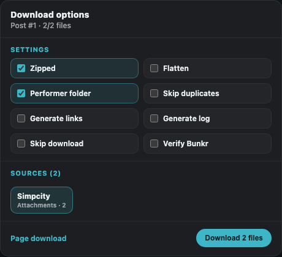

# $IMPC!TYDOWNLOADER

[](dist/%24IMPC%21TYDOWNLOADER.user.js)
[](LICENSE)
[](https://github.com/atedickfer/SIMPCITYDOWNLOADER/actions/workflows/validate.yml)

A Tampermonkey userscript for downloading images, videos, attachments, albums, and generated link lists from supported XenForo threads.

[Install $IMPC!TYDOWNLOADER](https://raw.githubusercontent.com/atedickfer/SIMPCITYDOWNLOADER/main/dist/%24IMPC%21TYDOWNLOADER.user.js)


## Highlights

- Download an individual post or batch selected posts from the current page.
- Dedicated **Download all images** and **Download all videos** actions.
- Create a real folder named after the performer on Chromium browsers.
- Portable performer-rooted ZIP fallback on browsers without directory access.
- ZIP or unzipped output, nested album folders, flattening, and duplicate removal.
- Optional `links.txt` and diagnostic `log.txt` generation.
- Per-source filtering and progress reporting.
- Resolvers for common media hosts including Bunkr, GoFile, Cyberdrop, Turbo, Filester, Pixeldrain, RedGifs, JPG hosts, and XenForo attachments.
- Settings persist between posts and page loads.

## Installation

1. Install a userscript manager such as [Tampermonkey](https://www.tampermonkey.net/).
2. Open the [raw userscript](https://raw.githubusercontent.com/atedickfer/SIMPCITYDOWNLOADER/main/dist/%24IMPC%21TYDOWNLOADER.user.js).
3. Approve the installation prompt.
4. Open a supported XenForo thread. Download controls will appear beside each post and in the page header.

The userscript currently matches the configured SimpCity thread domains listed in its metadata block. Add another XenForo domain only after reviewing the script's `@match` and `@connect` permissions.

## Quick start

### Download one post

Click **Download (x/x)** beside a post. Use the gear button to choose ZIP mode, flattening, performer folders, duplicate handling, generated links, logs, and sources.



### Download a page

Use **Download page** to select specific posts, or use **Download all images** / **Download all videos** for immediate media-type batches.


### Track the whole batch

A full-width progress bar stays fixed to the bottom of the screen and combines every active post and file into one overall count and percentage.


### Create performer folders

Open the gear menu and click **Create directory**. This enables **Performer folder** automatically and opens the destination picker immediately.

- **Chrome / Edge:** choose the parent destination—normally your Downloads folder. The script creates or reuses one performer directory inside it and shows **Ready** before downloading.
- **Other browsers or canceled picker:** the script downloads a ZIP whose root directory is the performer name, preserving the folder when extracted.

Example output:

```text
Downloads/
└── Fixture Performer/
    ├── #1.zip
    ├── #2.zip
    └── Album Name/
        ├── photo-01.jpg
        └── clip-01.mp4
```

More workflows are available in [Usage examples](docs/EXAMPLES.md).

## Compatibility

| Environment | Support | Performer-folder behavior |
| --- | --- | --- |
| Chrome + Tampermonkey | Recommended | Real directory through the folder picker |
| Edge + Tampermonkey | Recommended | Real directory through the folder picker |
| Firefox + Tampermonkey | Supported | Performer-rooted ZIP fallback |
| Other userscript managers | Best effort | Depends on GM API and `@require` compatibility |

Large files that a host forces into direct-download mode remain subject to the userscript manager's download-path behavior.

## Repository layout

```text
dist/$IMPC!TYDOWNLOADER.user.js      Installable userscript
docs/EXAMPLES.md                     Detailed usage examples
tests/xfpd-fixture.html              Offline XenForo fixture and API mocks
output/playwright/                   Reproducible README screenshots
```

## Development

No build step is required.

```bash
npm test
```

This validates JavaScript syntax and checks that the installable artifact still contains the expected userscript metadata. The browser fixture can be opened locally to inspect the injected controls without connecting to a live forum.

## Privacy and responsible use

The script runs locally in your browser. It does not include analytics or a telemetry service. It does make requests to the media hosts declared in the userscript metadata so it can resolve and download content.

Only download material you are authorized to access, and follow the forum's rules, host terms, and applicable law.

## License

[WTFPL](LICENSE)
